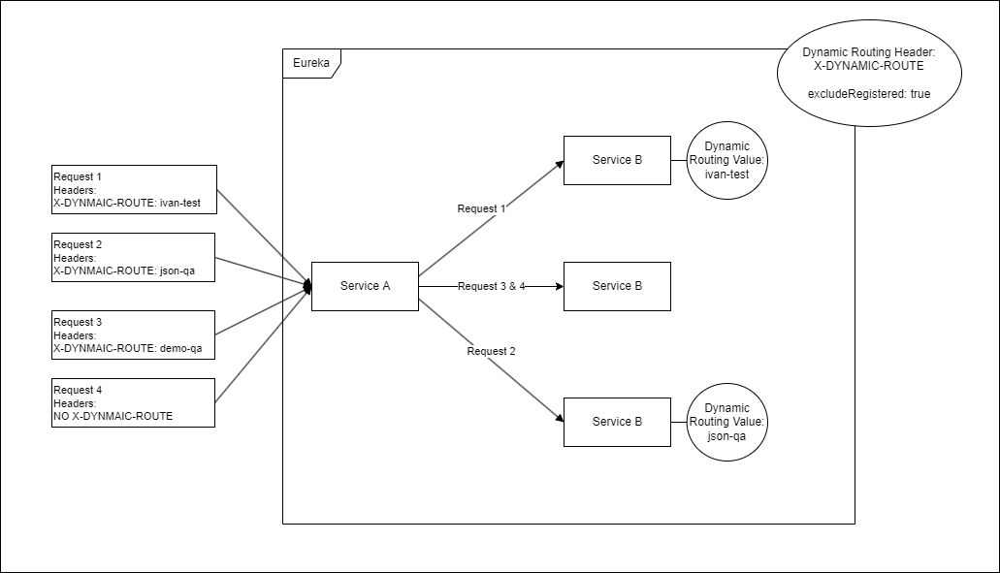

## SKYWALK DYNAMIC ROUTING LIB

---

This is a library created to realise the idea of dynamic routing with Feign Clients in Spring.

The idea is that with a configurable header a developer can hit a specific instance of a microservice in a chain of requests.
This library forwards the header between microservices thus even if the targeted microservice is in a long chain the header will still reach it.

The library is designed to be used only in testing environments.

Usage:
1. Import Library
    ```
       implementation "com.skywalk:skywalk-dynamic-routing-lib:1.0.0"
    ```
2. Enable Library
   ```
    @SpringBootApplication
    @EnableFeignClients           <--
    @EnableDiscoveryClient        <--
    @EnableSkywalkDynamicRouting  <--
    public class MyApp {

        public static void main(String[] args) {
            SpringApplication.run(MyApp.class, args);
        }

    }
   ```
3. Disable Library

    ```skywalk.dynamic-routing.enabled = false```
4. Configure Library
   1. Available configurations:
      - skywalk.dynamic-routing.header
        - ```Header name to use for dynamic routing```
      - skywalk.dynamic-routing.value
        - ```Value to use when service registers for dynamic routing```
      - skywalk.dynamic-routing.excludeRegistered
        - ```
          If no service is found with given dynamic routing value, should those who are registered be excluded.
          
          Example: You have microservice A (no dynamic routing) and B (dynamic routing with value john-test).
          The incoming request is without a dynamic routing header.
          
          If excludeRegistered is true (default) the request will be forwarded only to A (B is registered, therefor excluded), if excludeRegistered is false the request can be forwarded either to A or B
          ```
5. Example FLow



5. Sidenotes
- If the library detects this service is registering for dynamic routing, when starting a log will be printed in the format: 
  - ```Registered for dynamic routing: Header X-SKYWALK-DYNAMIC-ROUTING, Value 8083```